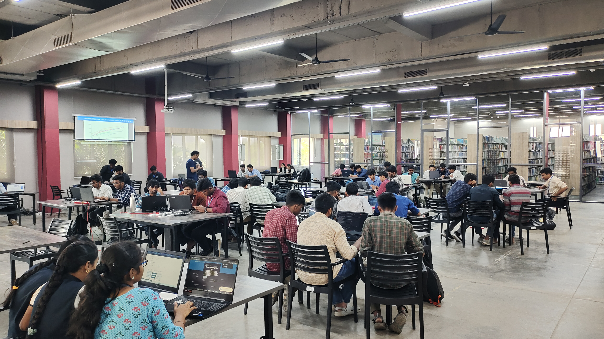

## Past Event 
## Team NOVA Intra CTF

OWASP KCT successfully organized and conducted the "Intra NOVA CTF" competition, led byTeam NOVA, which unfolded on 26th February 2024.bringing together cybersecurity enthusiasts from across the campus to engage in exhilarating challenges, showcasing their skills, and fostering a vibrant community of cyber defenders.

## Intro to Cybersecurity

OWASP KCT successfully organized the "Intro to Cybersecurity" session, led by Vishal ML, which unfolded on 20th November 2023. The session provided participants with a deep dive into fundamental concepts in cybersecurity, enhancing their understanding of this critical field.

