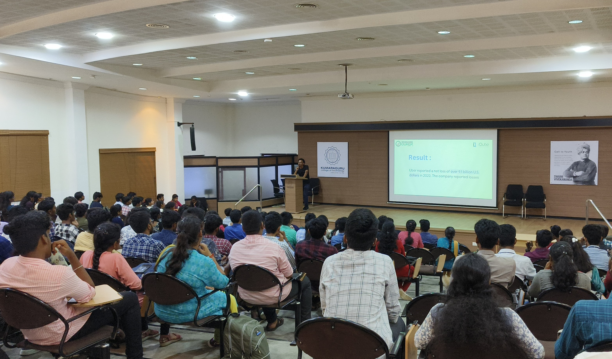

## Past Event 
## Intro to Cybersecurity

OWASP KCT successfully organized the "Intro to Cybersecurity" session, led by Vishal ML, which unfolded on 20th November 2023. The session provided participants with a deep dive into fundamental concepts in cybersecurity, enhancing their understanding of this critical field.

